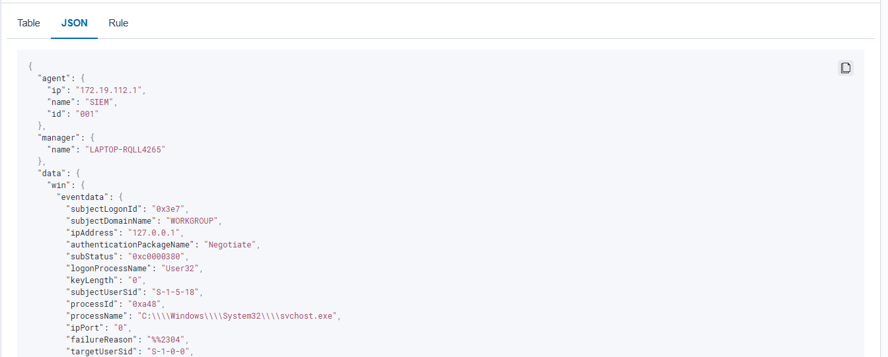
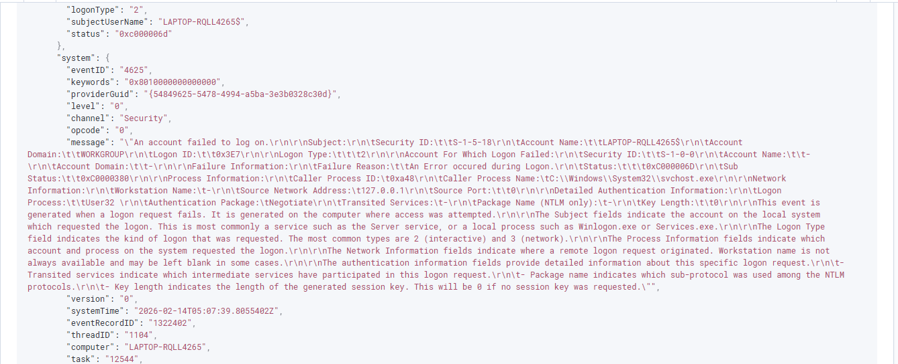
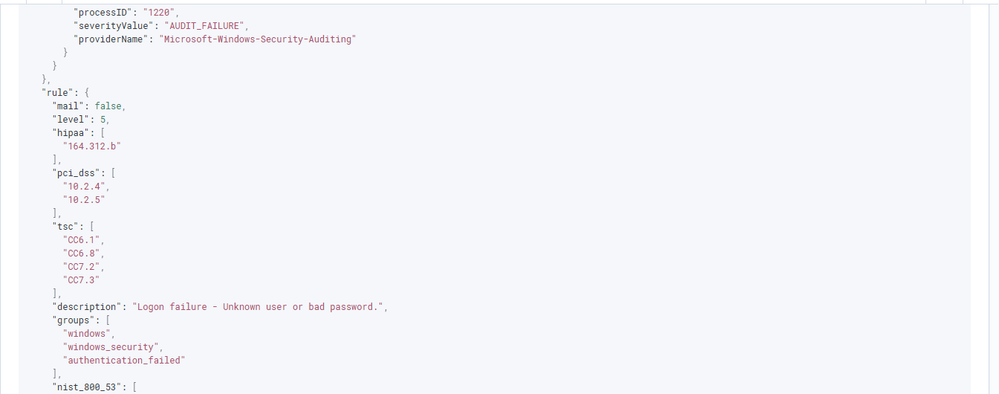
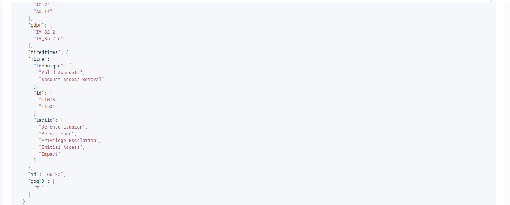
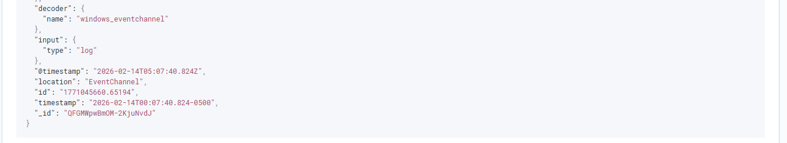

# Wazuh SIEM Home Lab

## Objective
Build a SIEM environment using Wazuh to detect and analyze simulated attack activity.

## Lab Architecture
- Wazuh Server (Linux)
- Windows Target Machine
- Kali Linux Attacker
- Sysmon for enhanced logging

## Attack Scenario Tested
- Brute force login attempts

## Detection & Analysis
- Alert review in Wazuh dashboard
- Log correlation
- MITRE ATT&CK mapping
- Investigation documentation
  
- ## Example Alert: Failed Login (Event ID 4625)

### Alert Summary
This screenshot shows the Wazuh dashboard detecting multiple failed login attempts:

### Rule Description
The rule that triggered this alert, with its ID and description:

### Raw Log (JSON)
The raw JSON event captured by Wazuh:

**Key Fields Observed:**
- `win.system.eventID`: 4625
- `win.eventdata.TargetUserName`: testuser
- `win.eventdata.IpAddress`: 127.0.0.1
- `agent.name`: LAPTOP-RQLL4265
- `rule.id`: 100001

### MITRE ATT&CK Mapping
**T1110 – Brute Force**

### Analyst Conclusion
Multiple failed login attempts were observed within a short time window.  
No successful authentication detected.  
Behavior consistent with brute-force simulation.

## Skills Demonstrated
- SIEM configuration
- Log analysis
- Threat detection
- Incident response workflow
